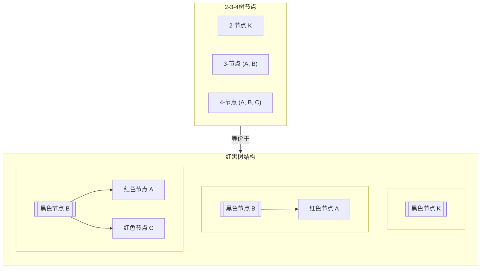

# 二叉树 (Binary Tree)

## 二叉搜索树（Binary Search Tree）

* 特点：对于每个节点，左子树的所有节点值都小于该节点值，右子树的所有节点值都大于该节点值

1. 优点
   * 查找、插入、删除操作的时间复杂度平均为O(log n)
   * 可以快速找到最小值和最大值
   * 中序遍历可以得到有序序列
   * 结构灵活，支持动态插入和删除

2. 缺点
   * 最坏情况下（如插入有序序列）会退化成链表，时间复杂度退化为O(n)
   * 没有自平衡机制，性能依赖于插入顺序
   * 删除操作相对复杂，需要考虑多种情况

3. 时间复杂度
   * 平均情况：查找、插入、删除 O(log n)
   * 最坏情况：查找、插入、删除 O(n)
   * 空间复杂度：O(n)

4. 适用场景
   * **数据动态变化**且需要频繁查找、插入、删除的场景
   * **需要有序数据**但又不想使用数组的场景
   * **实现映射（map）和集合（set）**等抽象数据类型

5. 插入操作
   * 原理：从根节点开始，比较待插入值与当前节点值，根据大小关系向左或向右递归（或迭代）直到找到空位置
   * 易错点：
     1. 注意处理重复值（根据定义，二叉搜索树通常不允许重复值，但也可以定义为左子树小于等于或右子树大于等于，根据具体实现而定）
     2. 注意空树的特殊情况，需要创建新节点作为根节点
     3. 迭代实现时，需要记录父节点以便插入

6. 删除操作
   * 原理：分三种情况处理：
     1. 要删除的节点是叶子节点：直接删除
     2. 要删除的节点只有一个子节点：用其子节点替换自己
     3. 要删除的节点有两个子节点：找到其前驱（右子树的最小节点）或者后继（左子树的最大节点）替换当前节点，然后删除那个最小（或最大）节点
   * 易错点：
     1. 需要维护树的连接，注意更新父节点的指针
     2. 删除节点有两个节点的情况应该优先处理成1，2两种情况，这样就可以综合处理
     3. 删除根节点时需要特殊处理

7. 查找操作
   * 原理：从根节点开始，比较待查找值与当前节点值，相等则找到，小于则向左子树查找，大于则向右子树查找
   * 易错点：注意处理空树和查找失败的情况

## 平衡二叉树（AVL Tree）

* 特点：是一种自平衡的二叉搜索树，任何节点的左右子树高度差不超过1

1. 优点
   * 保证树的高度始终为O(log n)，因此查找、插入、删除操作的最坏情况时间复杂度为O(log n)
   * 平衡性好，性能稳定

2. 缺点
   * 插入和删除操作可能需要通过一次或多次旋转来重新平衡，实现复杂
   * 旋转操作需要额外时间，常数因子较大

3. 适用场景
   * **需要保证最坏情况性能**的场景
   * **查找操作远多于插入删除**的场景
   * **对性能稳定性要求高**的应用

4. 旋转操作
   * 左旋：当右子树过高时，通过左旋降低右子树高度
   * 右旋：当左子树过高时，通过右旋降低左子树高度
   * 左右旋：先左旋再右旋，用于处理左子树的右子树过高的情况
   * 右左旋：先右旋再左旋，用于处理右子树的左子树过高的情况

## 红黑树 (Red Black Tree)

* 特点：是一种自平衡的二叉搜索树，通过颜色标记和旋转操作来保持平衡，确保从根到叶子的最长路径不超过最短路径的2倍

### 红黑树必须满足的性质：

1. **节点颜色性质**：每个节点要么是红色，要么是黑色  <=
2. **根节点性质**：根节点必须是黑色  <= 2-3-4树的节点
3. **叶子节点性质**：所有叶子节点（NIL节点）都是黑色 <=
4. **红色节点性质**：红色节点必定有两个黑色子节点（包括空的黑色子节点）（⭐即不能有两个连续的红色节点）
5. **路径性质**：从任一节点到其每个叶子节点的所有路径都包含相同数量的黑色节点

---

1. 优点
   * 平衡性较好，虽然不如AVL树严格，但旋转操作较少，插入和删除性能较好
   * 实际应用广泛，如C++的STL中的map和set，Java的TreeMap和TreeSet
2. 缺点
   * 实现复杂，需要处理颜色标记和多种旋转情况
   * 理论上的平衡性不如AVL树
3. 特点
   * 通过颜色约束和旋转操作维持近似平衡
   * 保证最坏情况下的时间复杂度为O(log n)
4. 适用场景
   * 需要频繁插入**删除**的场景（主要是删除，插入操作和avl树差不多）
   * **需要保证较好性能**的通用数据结构  
   * **实现关联数组和有序集合**

### 红黑树操作综合指南

#### 插入操作

**情况1：插入结点是根结点**  
- **操作**：直接变黑

**情况2：插入结点的叔叔是红色**  
- **操作**：叔、父、爷变色（父兄和父变黑，爷变红）  
- **后续**：爷爷节点变为新的插入结点（继续向上调整）

**情况3：插入结点的叔叔是黑色**  
- **操作**：根据情况执行旋转(LL, RR, LR, RL)  
- **后续**：将最后一步被旋转的节点和旋转轴变色（也就是LR/RL第一步旋转不变色）

**旋转类型：**  
- **LL**：右旋 + 变色  
- **RR**：左旋 + 变色  
- **LR**：先左旋后右旋 + 变色  
- **RL**：先右旋后左旋 + 变色

#### 删除操作

**简单情况（无需调整）**  
- **只有左孩子/只有右孩子**：用子节点代替后，子节点变黑  
- **红结点**：删除后无需任何调整

**复杂情况：删除黑节点后该黑节点变为双黑**

**情况1：兄弟至少有一个红孩子**  
- **调整方式**：(LL, RR, LR, RL)变色 + 旋转  
- **结果**：双黑变单黑

**情况2：兄弟是黑色**  
**子情况2.1：兄弟的孩子都是黑色**  
- **调整方式**：兄弟变红，双黑上移  
- **终止条件**：遇到红节点或根节点变为单黑

**子情况2.2：兄弟是红色**  
- **调整方式**：兄父变色，朝双黑方向旋转  
- **结果**：保持双黑状态，继续调整

## 红黑树模拟2-3-4树的核心规则

首先，记住这个根本概念：**红黑树中的一个“黑色节点”及其“红色子节点”共同代表了2-3-4树中的一个节点。**

---

### **规则一：节点类型转换**

这是所有规则的基础。它定义了两种数据结构间最基本的映射关系。

| 2-3-4树节点 | 红黑树中的等价结构                                           | 图示与解释                                                   |
| :---------- | :----------------------------------------------------------- | :----------------------------------------------------------- |
| **2-节点**  | 一个普通的**黑色**节点。                                     | `[B]` → `(B)`                                                |
| **3-节点**  | 一个**黑色**父节点和一个**红色**子节点组成。 有两种等价形式（“左倾”或“右倾”）。 | `[A, B]` → `(B)` → `(A)` （右倾，B为父）或 `<A>` ← `(B)`（左倾，A为父） |
| **4-节点**  | 一个**黑色**父节点和两个**红色**子节点组成。                 | `[A, B, C]` → `<A>` ← `(B)` → `<C>`                          |

### **规则二：插入模拟（核心是分裂）**

在2-3-4树中，插入总是在叶子节点进行，如果叶子是4-节点，就需要**分裂**。红黑树的插入修正就是在模拟这个过程。

1.  **目标**：始终将新插入的节点**先染成红色**。
    *   **为什么？** 因为插入一个红色节点，相当于尝试向2-3-4树的某个节点中添加一个新元素。如果该节点不是4-节点，添加成功。

2.  **情况A：叔叔节点为红色**
    *   **2-3-4树解释**：当前你正在尝试插入的节点是一个**4-节点**。
    *   **红黑树操作（分裂）**：进行 `叔、父、爷变色`（父与叔变黑，爷变红）。
    *   **模拟过程**：这正好模拟了将2-3-4树中的一个4-节点分裂：中间元素（爷爷）提升到父节点，剩下两个元素（父和叔）变成2-节点。然后将爷爷节点视为新插入的节点（红色），继续向上检查。

3.  **情况B：叔叔节点为黑色**
    *   **2-3-4树解释**：当前节点是一个**3-节点**或**2-节点**，有空间直接插入，但需要通过旋转来调整形态，以满足“左倾”、“右倾”或“不连续红”的约定。
    *   **红黑树操作（旋转+变色）**：通过 `LL, RR, LR, RL` 旋转，然后变色。
    *   **模拟过程**：旋转是为了将3-节点调整到正确的方向，并将中间的（黑色）节点提升为新的根，从而在局部形成一个合法的2-3-4树节点结构。

### **规则三：删除模拟（核心是合并/借用）**

删除黑节点后，为了弥补黑高的缺失，会产生“双黑”节点。这模拟了2-3-4树中删除导致节点下溢后的合并或向兄弟节点借元素的过程。

1.  **情况1：兄弟节点为红色**
    *   **2-3-4树解释**：你的兄弟节点不是一个直接的兄弟，因为在2-3-4树中，红色节点意味着它和父节点在同一个2-3-4树节点中。你需要通过旋转，找到一个**黑色的兄弟节点**（或者说让作为兄弟节点的子节点的234树兄弟节点变成红黑树中的兄弟节点）
    *   **红黑树操作**：`兄父变色，朝双黑旋转`。

2.  **情况2：兄弟节点为黑色，且至少有一个红色子节点**
    *   **2-3-4树解释**：你的兄弟节点是一个**3-节点或4-节点**，可以借一个元素给你。
    *   **红黑树操作**：`(LL, RR, LR, RL)旋转 + 变色`。
        兄弟节点继承父亲节点的颜色：维持234树中父亲节点的键数；父亲节点变黑：这样转到另一边时就将被删掉的黑补回去了，同时兄弟节点的子节点变黑也是为了维持黑色
    *   **模拟过程**：通过旋转和变色，将兄弟节点的一个元素（通过红色子节点代表）“借”给父节点，同时父节点的一个元素“下移”到当前节点，完成了一次借用，解决了下溢。
    
3.  **情况3：兄弟节点为黑色，且两个孩子都是黑色**
    *   **2-3-4树解释**：你的兄弟节点本身就是一个**2-节点**，无法出借元素。
    *   **红黑树操作**：`兄弟变红，双黑上移`。
    *   **模拟过程**：这模拟了**节点合并**。将父节点的一个元素拉下来，与当前节点和兄弟节点合并成一个临时的4-节点或3-节点。这个操作可能导致父节点出现“下溢”（双黑上移），需要继续向上处理。

### 总结

| 红黑树操作                  | 模拟的2-3-4树过程            | 目的                           |
| :-------------------------- | :--------------------------- | :----------------------------- |
| **插入时，新节点为红色**    | 向节点中添加新元素           | 尝试融入现有节点，避免破坏平衡 |
| **插入情况A（叔红）**       | **4-节点分裂**               | 节点已满，分裂并向上融合       |
| **插入情况B（叔黑）+ 旋转** | 调整**3-节点**的方向         | 在二叉树形态下正确表示多节点   |
| **删除产生“双黑”**          | 节点**下溢**（元素过少）     | 标记需要修复的路径             |
| **删除情况1（兄红）**       | 调整结构，找到真正的兄弟节点 | 为合并或借用做准备             |
| **删除情况2（兄有红子）**   | 向兄弟**3/4-节点借用**元素   | 解决下溢，保持节点容量         |
| **删除情况3（兄无红子）**   | **节点合并**                 | 解决下溢，可能引发向上传递     |

## 完全二叉树

* 特点：除最后一层外，其余层都是满的，并且最后一层的节点都靠左排列

1. 优点
   * 可以用数组存储，节省指针空间
   * 堆结构就是完全二叉树，适用于优先级队列

2. 缺点
   * 插入和删除操作可能需要调整结构以维持完全二叉树的性质

3. 适用场景
   * **堆排序**和**优先级队列**
   * **数组存储**以节省空间的二叉树

## 满二叉树

* 特点：除叶子节点外，每个节点都有两个子节点，且所有叶子节点都在同一层

1. 优点
   * 节点数达到最大值，结构整齐

2. 缺点
   * 只能有特定数量的节点（2^h - 1，h为高度）

3. 适用场景
   * 用于构建堆等数据结构
   * 用于某些算法中，如哈夫曼编码

## 二叉树的旋转

1. 左旋（\ 形状时进行）
   * 子节点的左节点变为当前节点的右节点
   * 当前节点变为子节点的左节点  
   * 让子节点变为根节点

2. 右旋（/ 形状时进行）
   * 子节点的右节点变为当前节点的左节点
   * 当前节点变为子节点的右节点
   * 让子节点变为根节点

3. 左右旋（< 形状时进行）
   * 先对当前节点的左子树进行左旋
   * 再对当前节点进行右旋

4. 右左旋（> 形状时进行）
   * 先对当前节点的右子树进行右旋
   * 再对当前节点进行左旋

## 二叉树遍历

1. 前序遍历：根 -> 左 -> 右
2. 中序遍历：左 -> 根 -> 右（对于二叉搜索树，中序遍历得到有序序列）
3. 后序遍历：左 -> 右 -> 根
4. 层序遍历：按层次从上到下，从左到右

* 应用场景：
  * 前序遍历：用于复制二叉树、计算前缀表达式等
  * 中序遍历：用于二叉搜索树的有序输出（提到中序遍历就想到BST中元素从左往右顺序排列）->可用于判断二叉树是否是BST，用于BST指定范围内元素搜索
  * 后序遍历：用于释放二叉树、计算后缀表达式等
  * 层序遍历：用于按层次处理节点，如查找某一层的节点

## 二叉树常见问题

1. 如何计算二叉树的高度？
   * 递归：高度 = max(左子树高度, 右子树高度) + 1

2. 如何判断两棵二叉树是否相同？
   * 递归比较根节点值，左子树和右子树是否相同

3. 如何判断二叉树是否为平衡二叉树？
   * 递归计算左右子树高度，判断高度差是否不超过1，并且左右子树都是平衡二叉树

4. 如何判断二叉树是否为二叉搜索树？
   * 中序遍历是否有序，或者递归判断每个节点是否在允许的范围内

5. 如何找到两个节点的最近公共祖先？
   * 递归遍历，如果当前节点为p或q，则返回当前节点；否则在左右子树中查找。如果左右子树分别找到p和q，则当前节点为最近公共祖先

6. 如何序列化和反序列化二叉树？
   * 前序遍历或层序遍历，将二叉树转换为字符串，并且能够根据字符串重建二叉树

## 二叉树的使用注意事项

1. 递归遍历时注意递归深度，可能导致栈溢出，可以使用迭代方法
2. 删除节点时注意内存释放，避免内存泄漏
3. 对于二叉搜索树，尽量避免插入有序序列，或者使用平衡二叉树
4. 在实现平衡二叉树时，注意旋转操作的正确性

## 二叉树与其他数据结构的比较

1. 与哈希表相比：
   * 二叉树支持有序数据操作，哈希表无序
   * 二叉树支持范围查询，哈希表只支持精确查询
   * 哈希表的平均查找速度更快，但最坏情况不如平衡二叉树

2. 与数组/链表相比：
   * 二叉树在动态插入删除和查找方面综合性能较好
   * 数组支持随机访问，链表支持顺序访问，二叉树支持有序访问

3. 与堆相比：
   * 堆是一种特殊的完全二叉树，主要用于快速找到最大/最小值，而二叉树（特别是二叉搜索树）支持更丰富的操作
